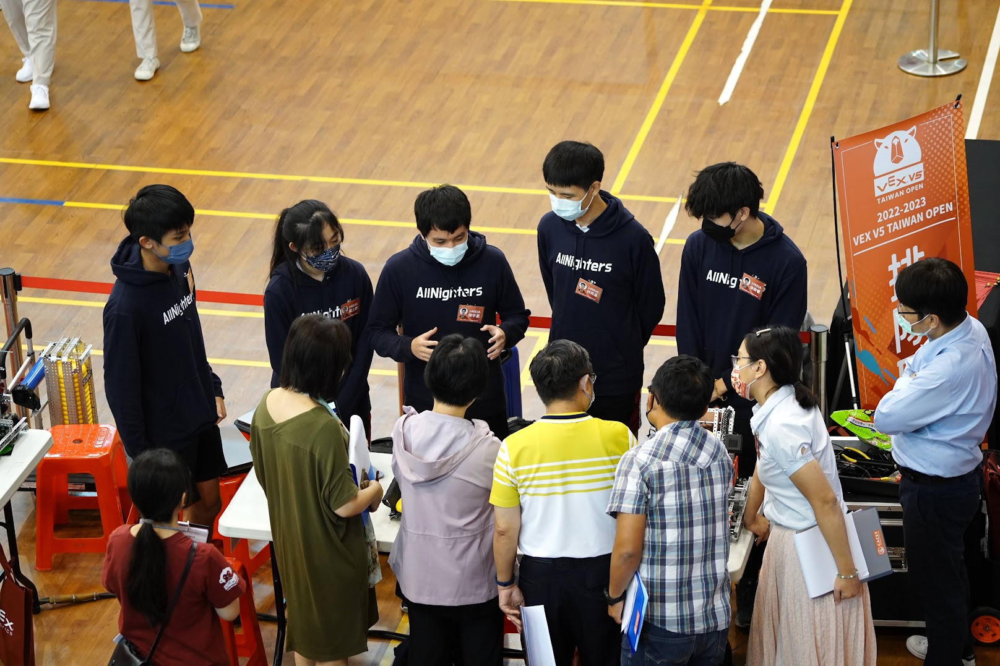
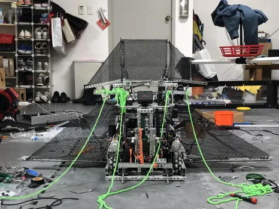
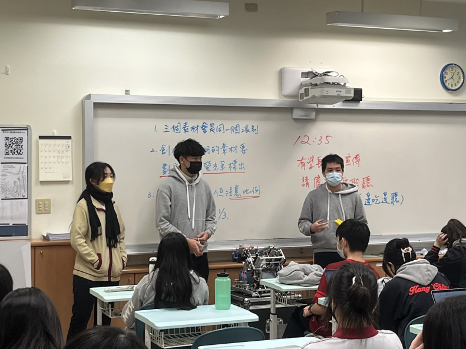

## About me

✋🏻 Hello! I'm Rocky Chen, a student studying Robotics Engineering Technology, Computer Sciencem, and Entrepreneurship and Innovation. Welcome to my corner of the internet.

## Who Am I?
I'm passionate about Control Engineering and STEM Education. Whether it's robotics contributing to numerous open-source control libraries, mentoring robotics competition teams from around the world, or volunteering for various robotics competitions, I thrive on making a difference in the world of technology and education.

## My Journey
### Robotics:
<!--  -->

My journey into robotics began with a Lube Goldberg competition back in 2021, where I started as a mechanical designer.
Along the way, I realized that controlling mechanisms is incredibly satisfying.
This realization led me to join the high school robotics club and step into the world of robotics.

### Education:
<!--  -->
Back in high school, I journey into robotics ignited a passion for reshaping STEM education.
I recognized the untapped potential of my peers hindered by limited resources. Committed to making a difference,
I mentored some high school robotics teams and founded a nonprofit educational organization,
driven by a vision to empower future generations through hands-on teaching and real-world applications.

## What Can You Expect?
Here, you'll discover a showcase of my robotics projects, each highlighting my passion and dedication to innovation in the field. Additionally, you'll find convenient links to explore my other online platforms and ventures. I'll also share glimpses of my personal journey through captivating pictures, offering insights into the places I go and the experiences that shape my life. Stay tuned for a blend of creativity, exploration, and technological marvels!
